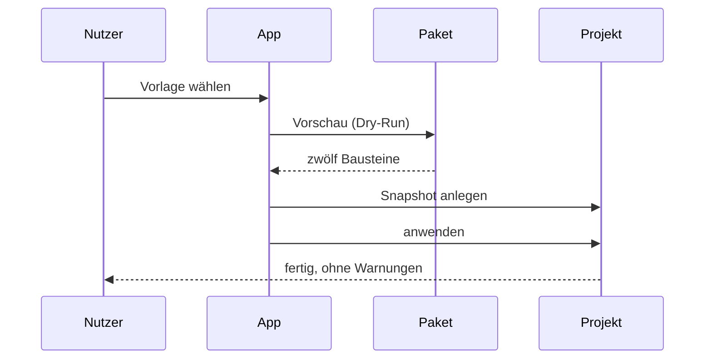

````md

```mermaid
sequenceDiagram
    Nutzer->>App: Vorlage wählen
    App->>Paket: Vorschau (Dry-Run)
    Paket-->>App: zwölf Bausteine
    App->>Projekt: Snapshot anlegen
    App->>Projekt: anwenden
    Projekt-->>Nutzer: fertig, ohne Warnungen
```
````


```mermaid
sequenceDiagram
    Nutzer->>App: Vorlage wählen
    App->>Paket: Vorschau (Dry-Run)
    Paket-->>App: zwölf Bausteine
    App->>Projekt: Snapshot anlegen
    App->>Projekt: anwenden
    Projekt-->>Nutzer: fertig, ohne Warnungen
```

Der durchgezogene Pfeil `->>` ist ein Aufruf, der gestrichelte `-->>` eine Antwort.
