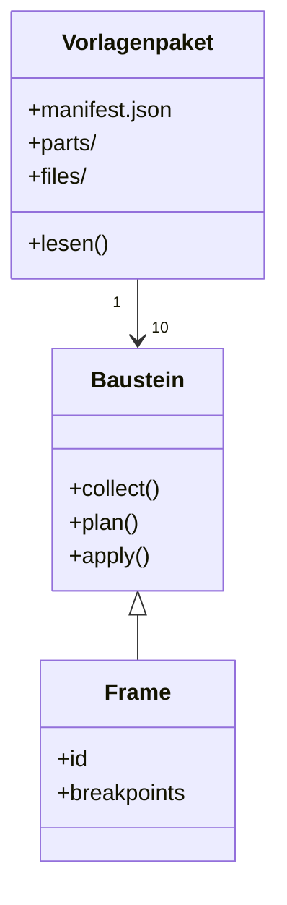
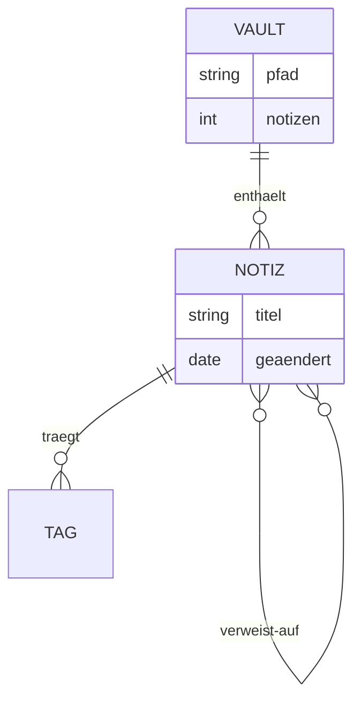
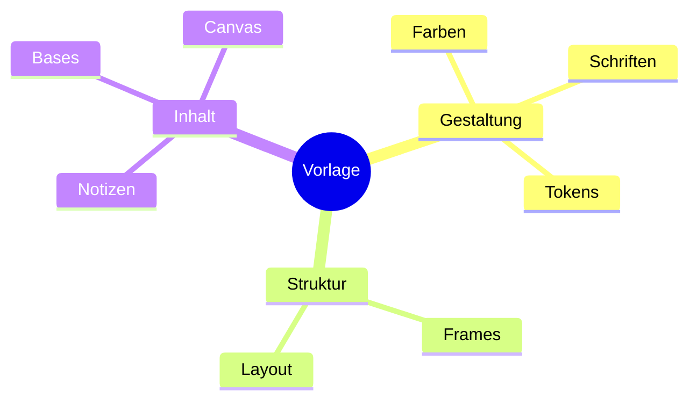

## Klassendiagramm

````md

````


> [!warning] Annotationen mit spitzen Klammern gehen hier nicht
> [[7-nachschlagen/01-glossar#Mermaid|Mermaid]] kennt für Klassen eine Annotation in der Form `<` `<Schnittstelle>` `>`. In Quartz
> überlebt sie nicht: Der Inhalt eines Mermaid-Blocks läuft durch dieselbe HTML-Verarbeitung wie
> der übrige Text, und die doppelten spitzen Klammern werden als Tag gelesen und entfernt. Übrig
> bleibt ein einzelnes `>` — und das Diagramm scheitert mit *Syntax error in text*.
>
> Gemessen an dieser Seite: Der Quelltext parst in Mermaid selbst fehlerfrei, im gebauten [[7-nachschlagen/01-glossar#HTML|HTML]] fehlt
> der Anfang des Blocks. Wer eine Schnittstelle kennzeichnen will, nimmt eine Anmerkung
> (`note for Baustein "Schnittstelle"`) oder schreibt es in den Klassennamen.

## Entity-Relationship

````md

````


## Mindmap

````md

````


