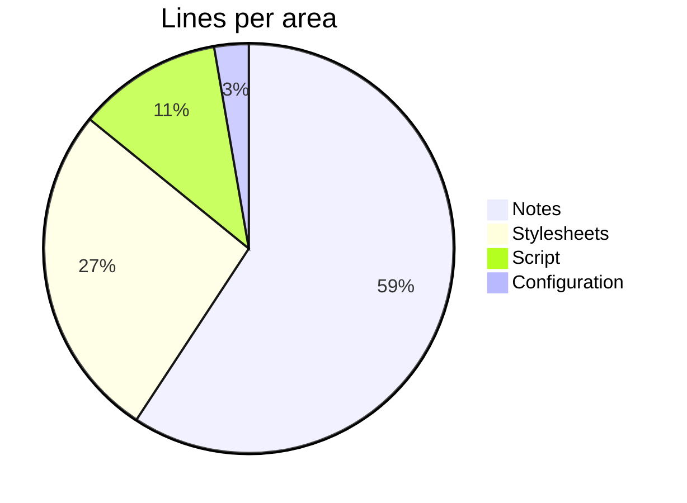
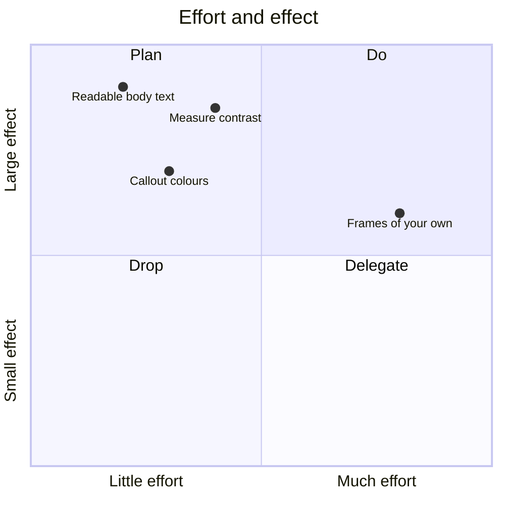
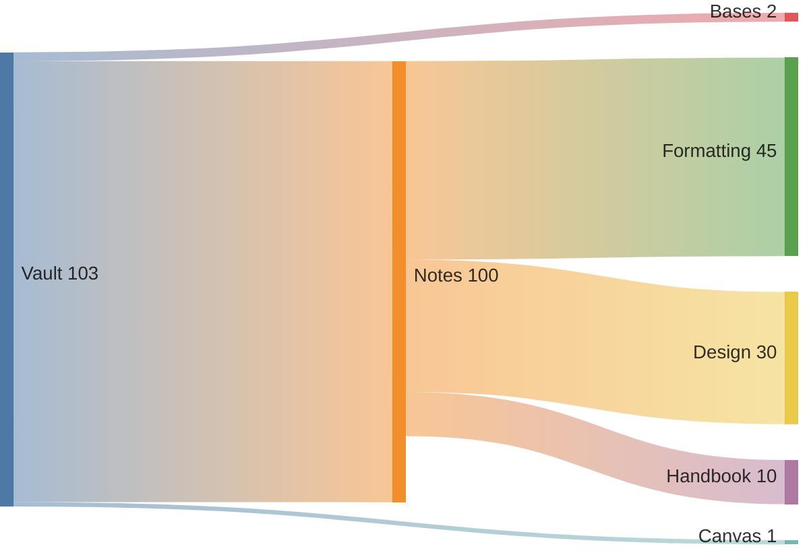
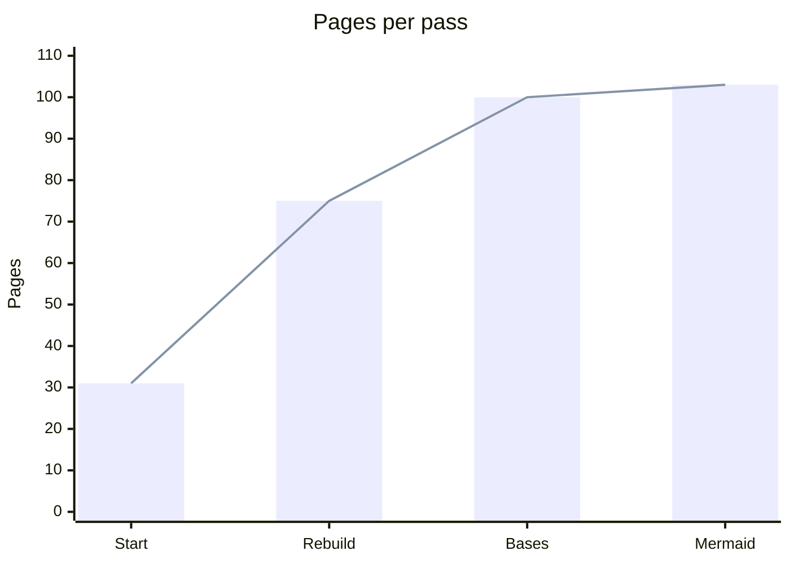

## Pie chart

````md

````


The numbers are real, rounded to hundreds and measured on 2026-09-05: notes are both languages
together, stylesheets the 34 files under `quartz/styles/custom/`, script the template build in the
app repository. They grow; the diagram does not follow on its own.

## Quadrant chart

````md

````


## Flow quantities

````md

````


## Curves and bars

````md

````


