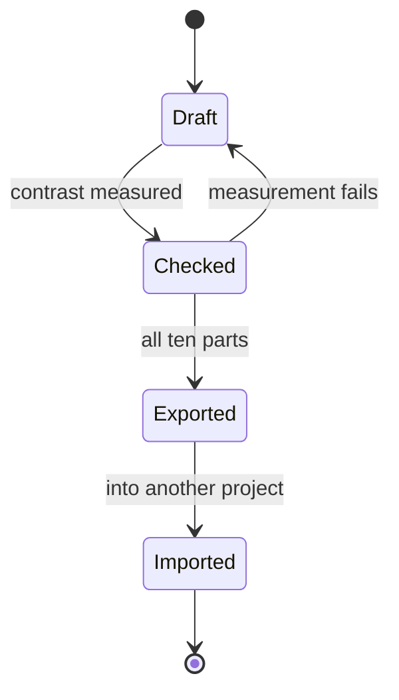
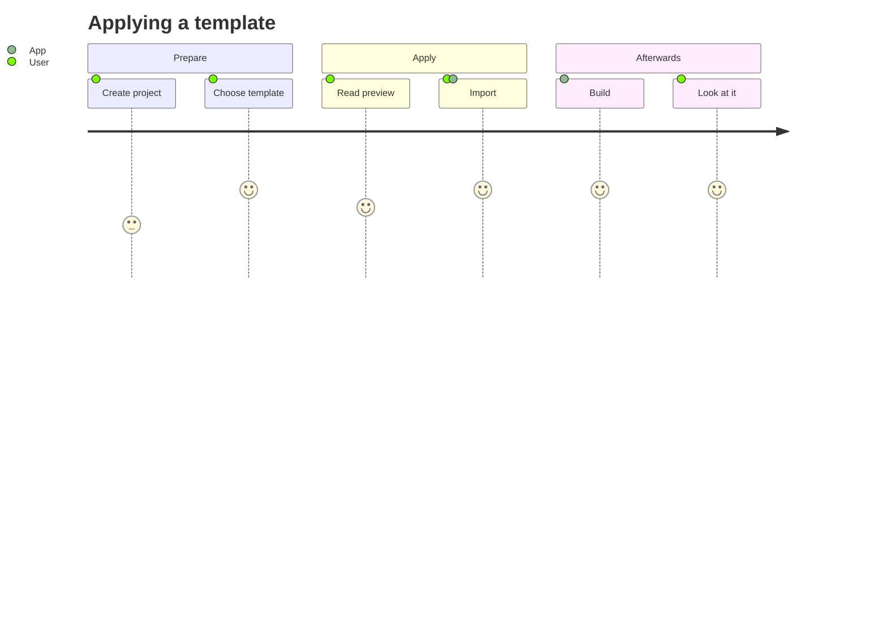
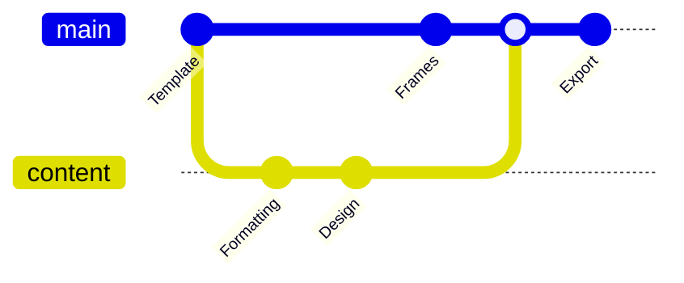

## State diagram

````md

```mermaid
stateDiagram-v2
    [*] --> Draft
    Draft --> Checked: contrast measured
    Checked --> Exported: all ten parts
    Exported --> Imported: into another project
    Imported --> [*]
    Checked --> Draft: measurement fails
```
````


```mermaid
stateDiagram-v2
    [*] --> Draft
    Draft --> Checked: contrast measured
    Checked --> Exported: all ten parts
    Exported --> Imported: into another project
    Imported --> [*]
    Checked --> Draft: measurement fails
```

## User journey

````md

```mermaid
journey
    title Applying a template
    section Prepare
      Create project: 3: User
      Choose template: 5: User
    section Apply
      Read preview: 4: User
      Import: 5: User, App
    section Afterwards
      Build: 5: App
      Look at it: 5: User
```
````


```mermaid
journey
    title Applying a template
    section Prepare
      Create project: 3: User
      Choose template: 5: User
    section Apply
      Read preview: 4: User
      Import: 5: User, App
    section Afterwards
      Build: 5: App
      Look at it: 5: User
```

## Branches

````md

```mermaid
gitGraph
    commit id: "Template"
    branch content
    commit id: "Formatting"
    commit id: "Design"
    checkout main
    commit id: "Frames"
    merge content
    commit id: "Export"
```
````


```mermaid
gitGraph
    commit id: "Template"
    branch content
    commit id: "Formatting"
    commit id: "Design"
    checkout main
    commit id: "Frames"
    merge content
    commit id: "Export"
```
