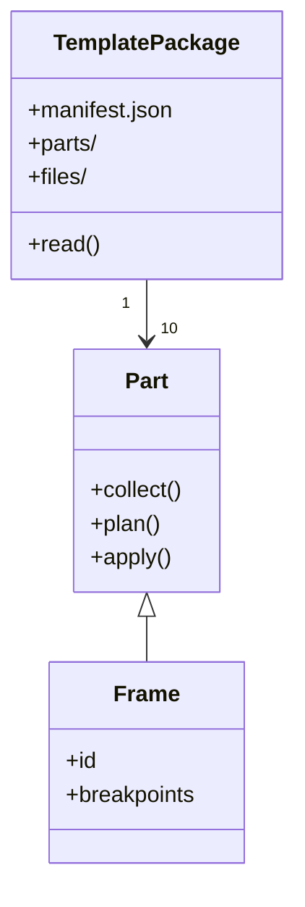
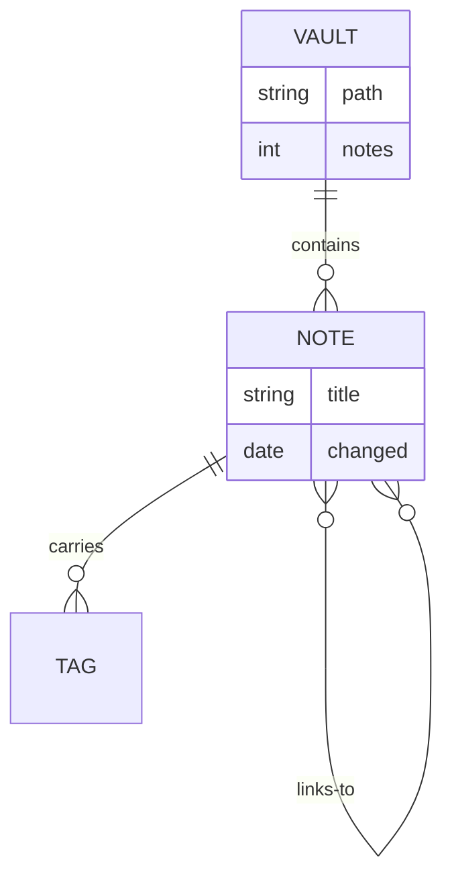
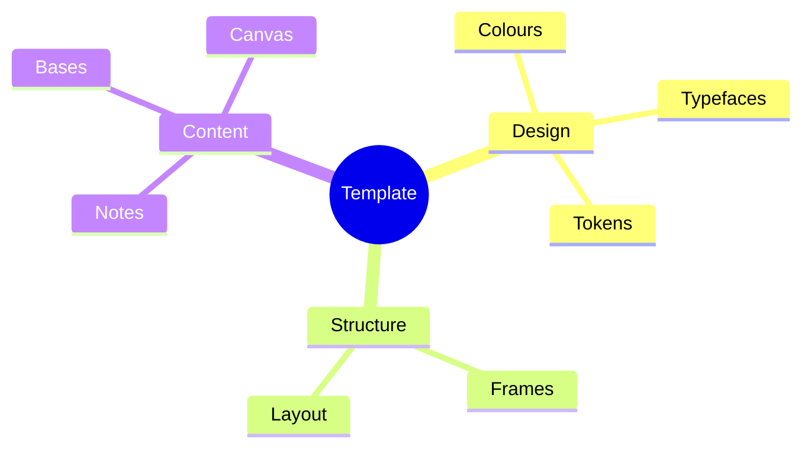

## Class diagram

````md

````


> [!warning] Annotations with angle brackets do not work here
> For classes [[en/7-reference/01-glossary#Mermaid|Mermaid]] knows an annotation of the form `<` `<interface>` `>`. In Quartz it does not
> survive: the content of a Mermaid block runs through the same [[en/7-reference/01-glossary#HTML|HTML]] processing as the rest of the
> text, and the double angle brackets are read as a tag and removed. What is left is a single `>` —
> and the diagram fails with *Syntax error in text*.
>
> Measured on this page: the source parses without error in Mermaid itself; in the built HTML the
> start of the block is missing. Anyone wanting to mark an interface uses a note
> (`note for Part "Interface"`) or writes it into the class name.

## Entity relationship

````md

````


## Mind map

````md

````


