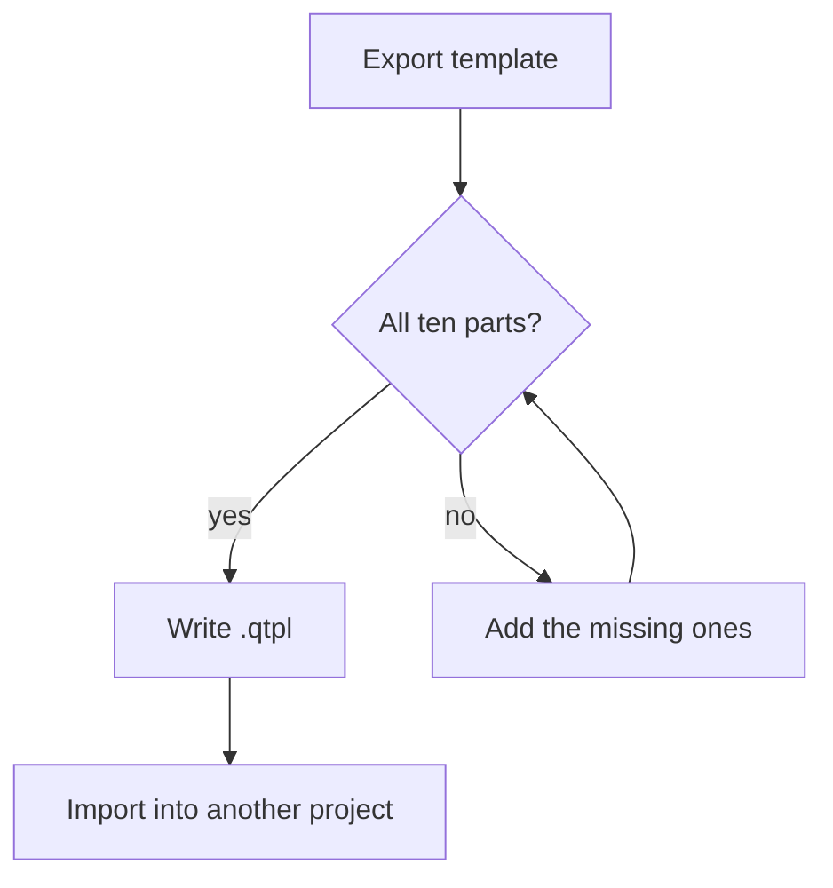
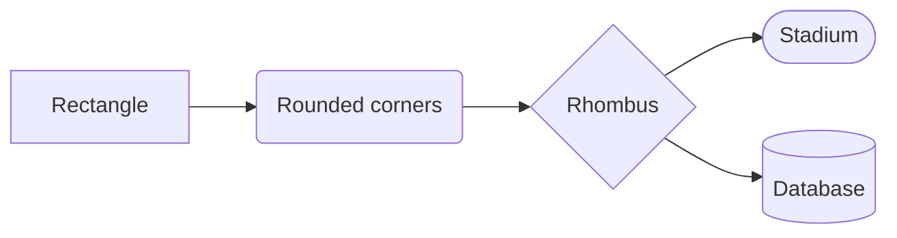

````md

```mermaid
flowchart TD
    A[Export template] --> B{All ten parts?}
    B -->|yes| C[Write .qtpl]
    B -->|no| D[Add the missing ones]
    D --> B
    C --> E[Import into another project]
```
````


```mermaid
flowchart TD
    A[Export template] --> B{All ten parts?}
    B -->|yes| C[Write .qtpl]
    B -->|no| D[Add the missing ones]
    D --> B
    C --> E[Import into another project]
```

## Direction and shapes

`TD` means top down, `LR` left to right.

````md

```mermaid
flowchart LR
    A[Rectangle] --> B(Rounded corners)
    B --> C{Rhombus}
    C --> D([Stadium])
    C --> E[(Database)]
```
````


```mermaid
flowchart LR
    A[Rectangle] --> B(Rounded corners)
    B --> C{Rhombus}
    C --> D([Stadium])
    C --> E[(Database)]
```
