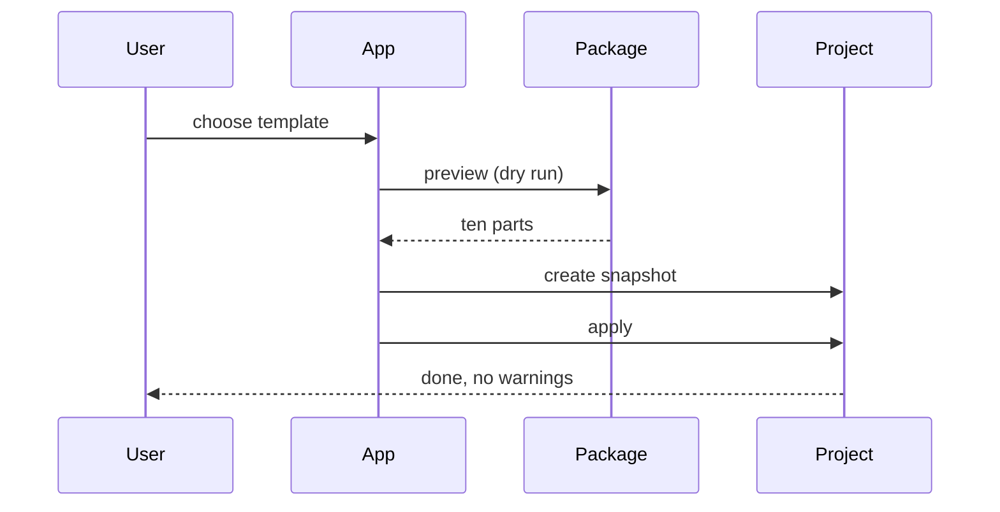

````md

```mermaid
sequenceDiagram
    User->>App: choose template
    App->>Package: preview (dry run)
    Package-->>App: ten parts
    App->>Project: create snapshot
    App->>Project: apply
    Project-->>User: done, no warnings
```
````


```mermaid
sequenceDiagram
    User->>App: choose template
    App->>Package: preview (dry run)
    Package-->>App: ten parts
    App->>Project: create snapshot
    App->>Project: apply
    Project-->>User: done, no warnings
```

The solid arrow `->>` is a call, the dashed `-->>` a reply.
