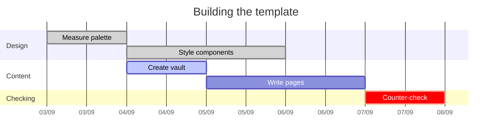
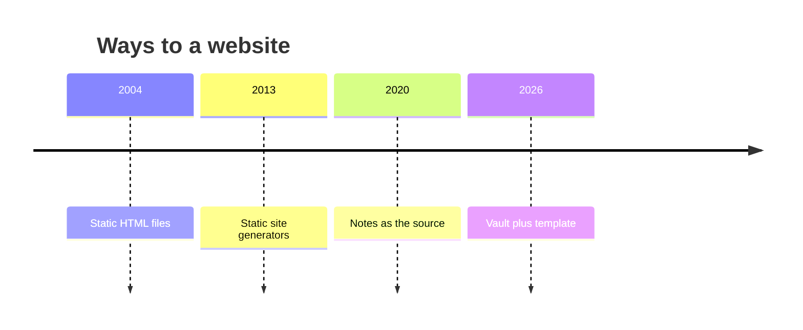

## Gantt

````md

```mermaid
gantt
    title Building the template
    dateFormat YYYY-MM-DD
    axisFormat %d/%m
    section Design
    Measure palette     :done, a1, 2026-09-03, 1d
    Style components    :done, a2, after a1, 2d
    section Content
    Create vault        :active, b1, 2026-09-04, 1d
    Write pages         :b2, after b1, 2d
    section Checking
    Counter-check       :crit, c1, after b2, 1d
```
````


```mermaid
gantt
    title Building the template
    dateFormat YYYY-MM-DD
    axisFormat %d/%m
    section Design
    Measure palette     :done, a1, 2026-09-03, 1d
    Style components    :done, a2, after a1, 2d
    section Content
    Create vault        :active, b1, 2026-09-04, 1d
    Write pages         :b2, after b1, 2d
    section Checking
    Counter-check       :crit, c1, after b2, 1d
```

The markers `done`, `active` and `crit` colour the bar differently.

## Timeline

````md

```mermaid
timeline
    title Ways to a website
    2004 : Static HTML files
    2013 : Static site generators
    2020 : Notes as the source
    2026 : Vault plus template
```
````


```mermaid
timeline
    title Ways to a website
    2004 : Static HTML files
    2013 : Static site generators
    2020 : Notes as the source
    2026 : Vault plus template
```
