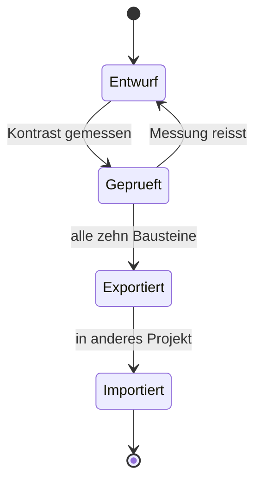
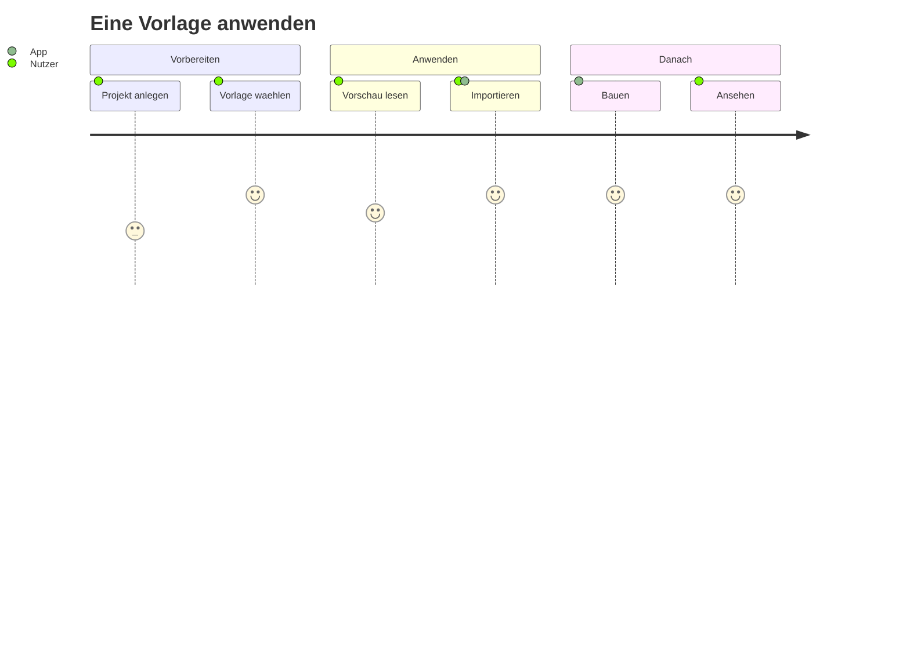
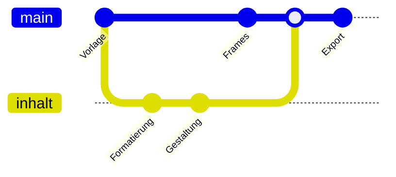

## Zustandsdiagramm

````md

```mermaid
stateDiagram-v2
    [*] --> Entwurf
    Entwurf --> Geprueft: Kontrast gemessen
    Geprueft --> Exportiert: alle zehn Bausteine
    Exportiert --> Importiert: in anderes Projekt
    Importiert --> [*]
    Geprueft --> Entwurf: Messung reisst
```
````


```mermaid
stateDiagram-v2
    [*] --> Entwurf
    Entwurf --> Geprueft: Kontrast gemessen
    Geprueft --> Exportiert: alle zehn Bausteine
    Exportiert --> Importiert: in anderes Projekt
    Importiert --> [*]
    Geprueft --> Entwurf: Messung reisst
```

## Nutzerreise

````md

```mermaid
journey
    title Eine Vorlage anwenden
    section Vorbereiten
      Projekt anlegen: 3: Nutzer
      Vorlage waehlen: 5: Nutzer
    section Anwenden
      Vorschau lesen: 4: Nutzer
      Importieren: 5: Nutzer, App
    section Danach
      Bauen: 5: App
      Ansehen: 5: Nutzer
```
````


```mermaid
journey
    title Eine Vorlage anwenden
    section Vorbereiten
      Projekt anlegen: 3: Nutzer
      Vorlage waehlen: 5: Nutzer
    section Anwenden
      Vorschau lesen: 4: Nutzer
      Importieren: 5: Nutzer, App
    section Danach
      Bauen: 5: App
      Ansehen: 5: Nutzer
```

## Versionsstränge

````md

```mermaid
gitGraph
    commit id: "Vorlage"
    branch inhalt
    commit id: "Formatierung"
    commit id: "Gestaltung"
    checkout main
    commit id: "Frames"
    merge inhalt
    commit id: "Export"
```
````


```mermaid
gitGraph
    commit id: "Vorlage"
    branch inhalt
    commit id: "Formatierung"
    commit id: "Gestaltung"
    checkout main
    commit id: "Frames"
    merge inhalt
    commit id: "Export"
```
