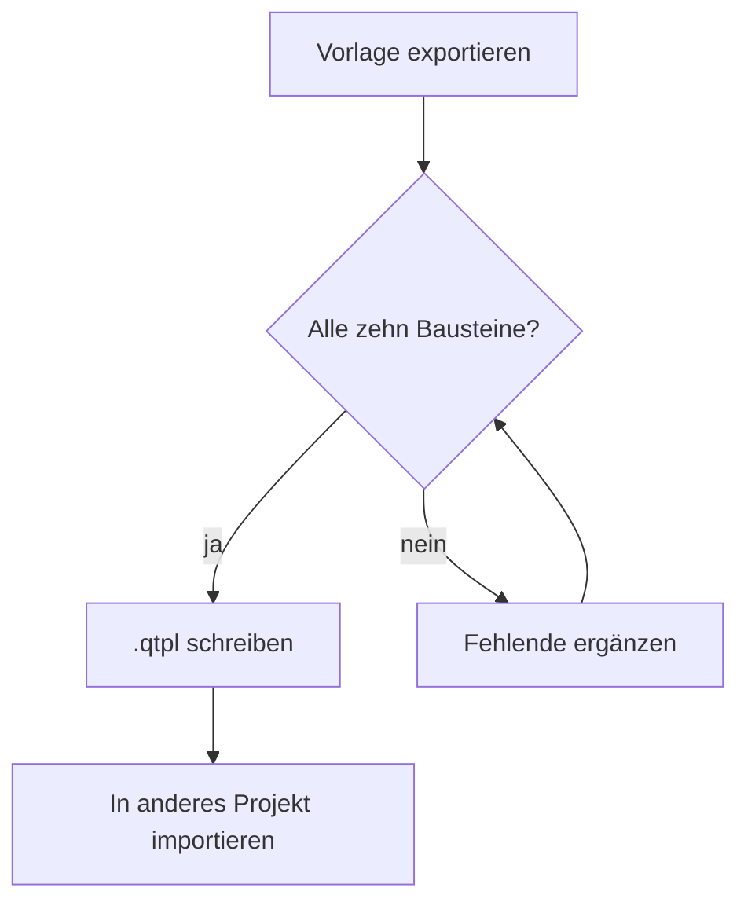
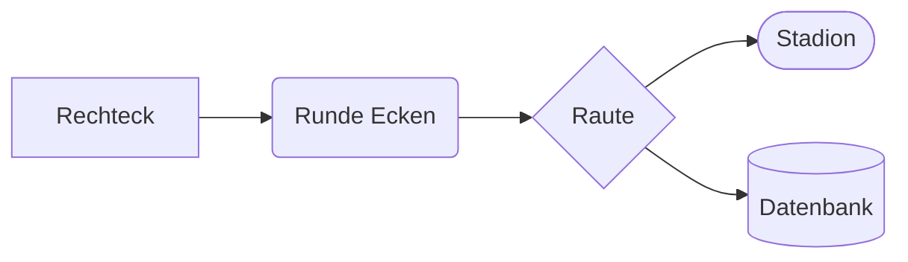

````md

```mermaid
flowchart TD
    A[Vorlage exportieren] --> B{Alle zehn Bausteine?}
    B -->|ja| C[.qtpl schreiben]
    B -->|nein| D[Fehlende ergänzen]
    D --> B
    C --> E[In anderes Projekt importieren]
```
````


```mermaid
flowchart TD
    A[Vorlage exportieren] --> B{Alle zehn Bausteine?}
    B -->|ja| C[.qtpl schreiben]
    B -->|nein| D[Fehlende ergänzen]
    D --> B
    C --> E[In anderes Projekt importieren]
```

## Richtung und Formen

`TD` heißt von oben nach unten, `LR` von links nach rechts.

````md

```mermaid
flowchart LR
    A[Rechteck] --> B(Runde Ecken)
    B --> C{Raute}
    C --> D([Stadion])
    C --> E[(Datenbank)]
```
````


```mermaid
flowchart LR
    A[Rechteck] --> B(Runde Ecken)
    B --> C{Raute}
    C --> D([Stadion])
    C --> E[(Datenbank)]
```
