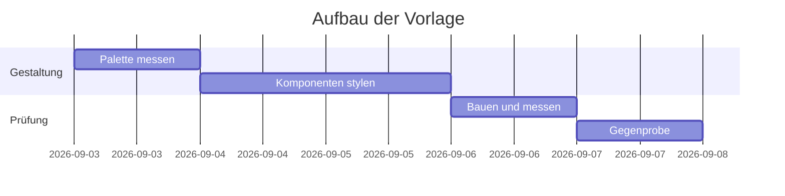
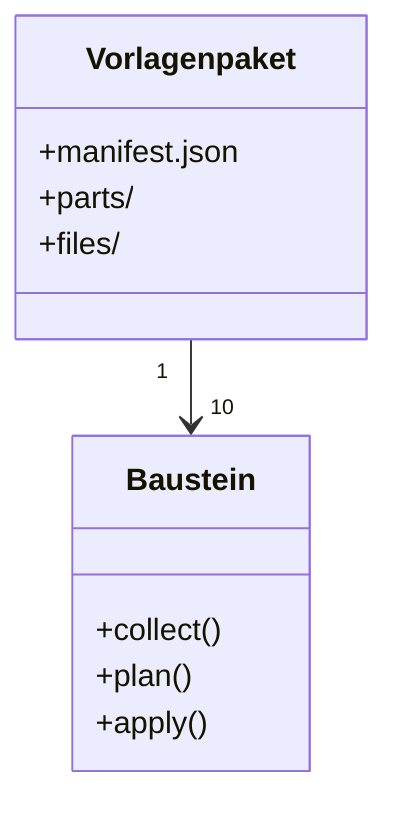
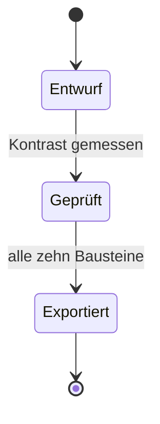

## Gantt

## Klassen

## Zustände

## In dieser Vorlage

Die Diagramme bringen ihre eigenen Farben mit; die Vorlage gestaltet nur den Kasten darum — Fläche,
Rahmen, Ecken, Scrollverhalten. Ein halb umgefärbtes Diagramm ist schlechter als ein fremdfarbiges,
weil Mermaid seine Farben zur Laufzeit auflöst und ein Stylesheet dabei immer nur die Hälfte trifft.
