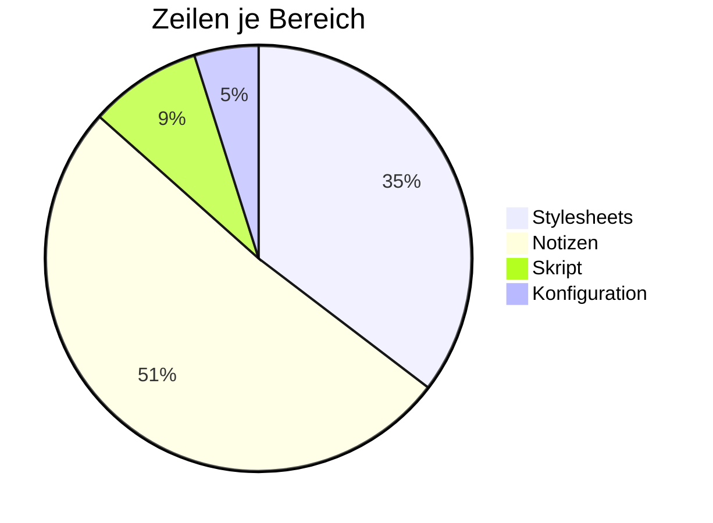
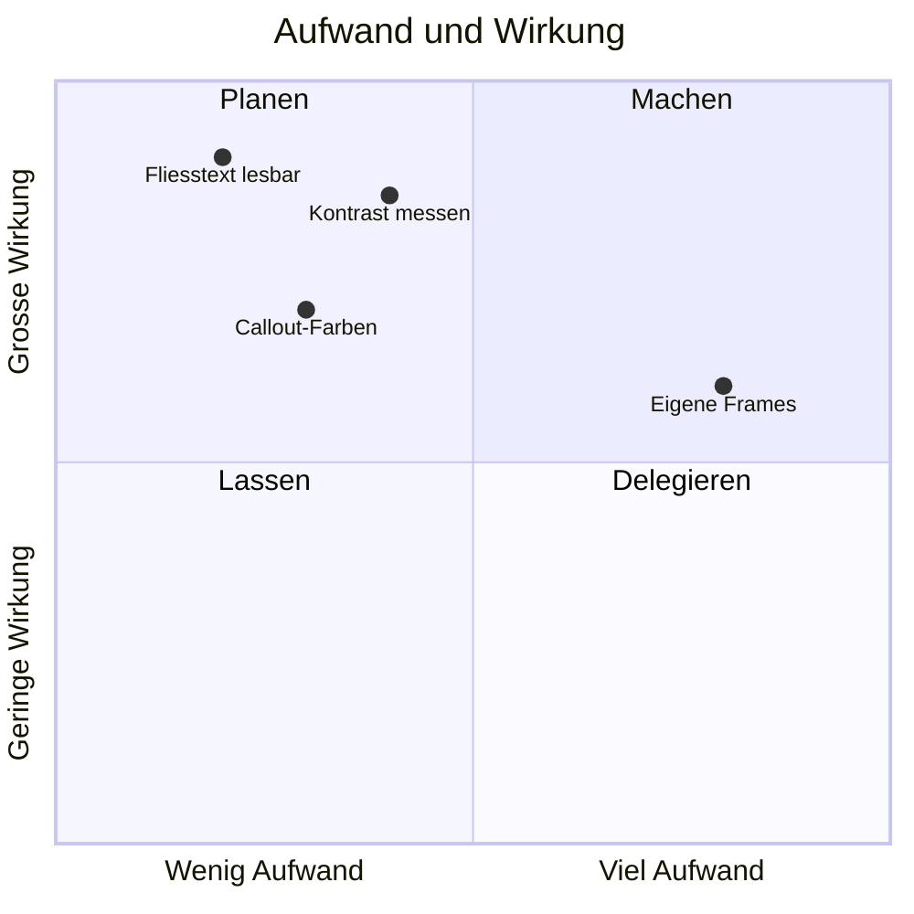
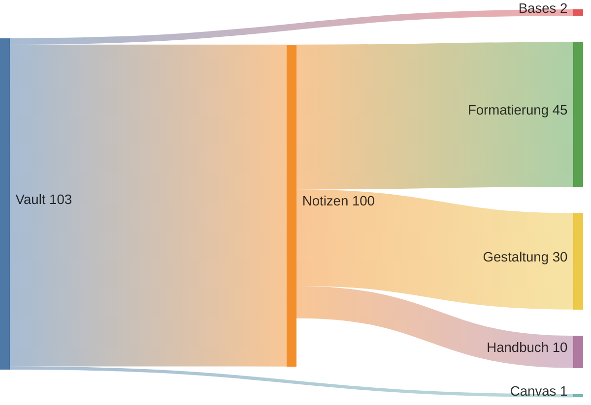
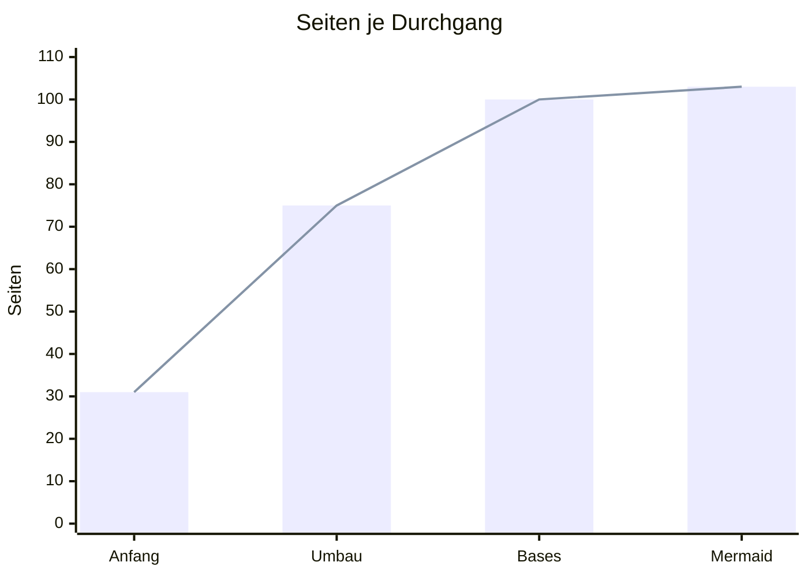

## Tortendiagramm

````md

```mermaid
pie title Zeilen je Bereich
    "Stylesheets" : 2900
    "Notizen" : 4200
    "Skript" : 700
    "Konfiguration" : 400
```
````


```mermaid
pie title Zeilen je Bereich
    "Stylesheets" : 2900
    "Notizen" : 4200
    "Skript" : 700
    "Konfiguration" : 400
```

## Vier-Felder-Tafel

````md

```mermaid
quadrantChart
    title Aufwand und Wirkung
    x-axis Wenig Aufwand --> Viel Aufwand
    y-axis Geringe Wirkung --> Grosse Wirkung
    quadrant-1 Machen
    quadrant-2 Planen
    quadrant-3 Lassen
    quadrant-4 Delegieren
    Fliesstext lesbar: [0.2, 0.9]
    Kontrast messen: [0.4, 0.85]
    Eigene Frames: [0.8, 0.6]
    Callout-Farben: [0.3, 0.7]
```
````


```mermaid
quadrantChart
    title Aufwand und Wirkung
    x-axis Wenig Aufwand --> Viel Aufwand
    y-axis Geringe Wirkung --> Grosse Wirkung
    quadrant-1 Machen
    quadrant-2 Planen
    quadrant-3 Lassen
    quadrant-4 Delegieren
    Fliesstext lesbar: [0.2, 0.9]
    Kontrast messen: [0.4, 0.85]
    Eigene Frames: [0.8, 0.6]
    Callout-Farben: [0.3, 0.7]
```

## Flussmengen

````md

```mermaid
sankey-beta
Vault,Notizen,100
Vault,Bases,2
Vault,Canvas,1
Notizen,Formatierung,45
Notizen,Gestaltung,30
Notizen,Handbuch,10
```
````


```mermaid
sankey-beta
Vault,Notizen,100
Vault,Bases,2
Vault,Canvas,1
Notizen,Formatierung,45
Notizen,Gestaltung,30
Notizen,Handbuch,10
```

## Kurven und Balken

````md

```mermaid
xychart-beta
    title "Seiten je Durchgang"
    x-axis [Anfang, Umbau, Bases, Mermaid]
    y-axis "Seiten" 0 --> 110
    bar [31, 75, 100, 103]
    line [31, 75, 100, 103]
```
````


```mermaid
xychart-beta
    title "Seiten je Durchgang"
    x-axis [Anfang, Umbau, Bases, Mermaid]
    y-axis "Seiten" 0 --> 110
    bar [31, 75, 100, 103]
    line [31, 75, 100, 103]
```
