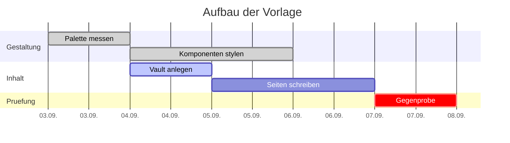
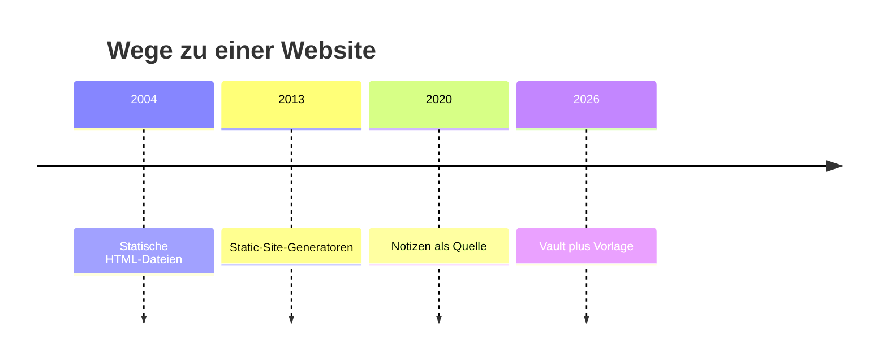

## Gantt

````md

```mermaid
gantt
    title Aufbau der Vorlage
    dateFormat YYYY-MM-DD
    axisFormat %d.%m.
    section Gestaltung
    Palette messen      :done, a1, 2026-09-03, 1d
    Komponenten stylen  :done, a2, after a1, 2d
    section Inhalt
    Vault anlegen       :active, b1, 2026-09-04, 1d
    Seiten schreiben    :b2, after b1, 2d
    section Pruefung
    Gegenprobe          :crit, c1, after b2, 1d
```
````


```mermaid
gantt
    title Aufbau der Vorlage
    dateFormat YYYY-MM-DD
    axisFormat %d.%m.
    section Gestaltung
    Palette messen      :done, a1, 2026-09-03, 1d
    Komponenten stylen  :done, a2, after a1, 2d
    section Inhalt
    Vault anlegen       :active, b1, 2026-09-04, 1d
    Seiten schreiben    :b2, after b1, 2d
    section Pruefung
    Gegenprobe          :crit, c1, after b2, 1d
```

Die Kennzeichnungen `done`, `active` und `crit` färben den Balken unterschiedlich ein.

## Zeitleiste

````md

```mermaid
timeline
    title Wege zu einer Website
    2004 : Statische HTML-Dateien
    2013 : Static-Site-Generatoren
    2020 : Notizen als Quelle
    2026 : Vault plus Vorlage
```
````


```mermaid
timeline
    title Wege zu einer Website
    2004 : Statische HTML-Dateien
    2013 : Static-Site-Generatoren
    2020 : Notizen als Quelle
    2026 : Vault plus Vorlage
```
